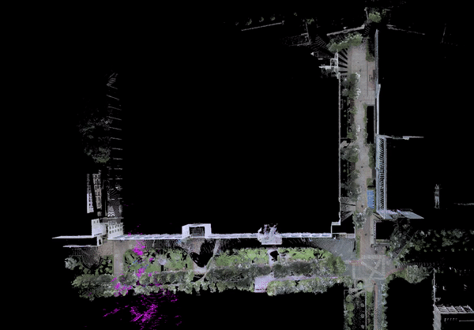

# POINT-LIO-LOCALIZATION

A simple localization framework that can re-localize in built maps based on [POINT-LIO](https://github.com/hku-mars/Point-LIO) and works with ROS Noetic. 

## News

~~- **2024-08-29:** [small_gicp](https://github.com/koide3/small_gicp) by kenji koide implemented for robust, fast, threaded scan-to-map matching (By Jason Kim)

~~- **2024-08-28:** FAST-LIO altered with **POINT-LIO**, now running extensively robust to drift (By Jason Kim)

~~- **2023:** Add **Open3D 0.13** support. (By Jason Kim)

~~- **2021-08-11:** Add **Open3D 0.7** support.
  
~~- **2021-08-09:** Migrate to **Open3D** for better performance.

## 1. Features
- Realtime 3D global localization in a pre-built point cloud map. 
  By fusing low-frequency global localization (about 0.5~0.2Hz), and high-frequency odometry from FAST-LIO, the entire system is computationally efficient.

<div align="center"></div>

- Eliminate the accumulative error of the odometry.

<div align="center"></div>

- The initial localization can be provided either by rough manual estimation from RVIZ, or pose from another sensor/algorithm.
- Using Small_GICP, the registration now accepts more tolerence in rough initial pose input, subsequently robust to unstructured and dynamic query input.

<!--  -->
<!-- [](https://youtu.be/2OvjGnxszf8) -->
<div align="center">

</div>


## 2. Prerequisites
### 2.1 Dependencies for POINT-LIO

Technically, if you have built and run POINT-LIO before, you may skip section 2.1.

This part of dependency is consistent with POINT-LIO, please refer to the documentation [POINT-LIO prequisites](https://github.com/hku-mars/Point-LIO?tab=readme-ov-file#3-prerequisites)
### 2.2 Dependencies for localization module

- ~~python 2.7~~ python 3.8

- [ros_numpy](https://github.com/eric-wieser/ros_numpy)

```shell
sudo apt install ros-$ROS_DISTRO-ros-numpy
pip install numpy==1.21
```

- [Open3D](http://www.open3d.org/docs/0.9.0/getting_started.html)

~~pip install open3d==0.9~~
pip install open3d==0.13

~~Notice that, there may be issue when installing **Open3D** directly using pip in **Python2.7**:~~

~~you may firstly install **pyrsistent**:~~

~~Then~~

~~pip install open3d==0.9~~
Just pip install open3d==0.13 (or later version)


## 3. Build
Clone the repository and catkin_make:

```
    cd ~/$A_ROS_DIR$/src
    git clone https://github.com/U-AMC/POINT_LIO_LOCALIZATION
    cd POINT_LIO_LOCALIZATION
    git submodule update --init
    cd ../..
    catkin_make
    source devel/setup.bash
```
- Remember to source the livox_ros_driver before build (follow [livox_ros_driver](https://github.com/hku-mars/FAST_LIO#13-livox_ros_driver))
- If you want to use a custom build of PCL, add the following line to ~/.bashrc
  ```export PCL_ROOT={CUSTOM_PCL_PATH}```


## 4. Run Localization
### 4.1 Sample Dataset

Demo rosbag in a large underground garage: 
[Google Drive](https://drive.google.com/file/d/15ZZAcz84mDxaWviwFPuALpkoeK-KAh-4/view?usp=sharing) | [Baidu Pan (Code: ne8d)](https://pan.baidu.com/s/1ceBiIAUqHa1vY3QjWpxwNA);

Corresponding map: [Google Drive](https://drive.google.com/file/d/1X_mhPlSCNj-1erp_DStCQZfkY7l4w7j8/view?usp=sharing) | [Baidu Pan (Code: kw6f)](https://pan.baidu.com/s/1Yw4vY3kEK8x2g-AsBi6VCw)

The map can be built using LIO-SAM or FAST-LIO-SLAM. 

### 4.2 Run

1. First, please make sure you're using the **Python ~~2.7~~ 3.8** environment;


2. Run localization, here we take Livox AVIA as an example:

```shell
roslaunch point_lio_localization localization_avia.launch map:=/path/to/your/map.pcd
```

Please modify `/path/to/your/map.pcd` to your own map point cloud file path.

Wait for 3~5 seconds until the map cloud shows up in RVIZ;

3. If you are testing with the sample rosbag data:
```shell
rosbag play localization_test_scene_1.bag
```

Or if you are running realtime

```shell
roslaunch livox_ros_driver livox_lidar_msg.launch
```
Please set the **publish_freq** in **livox_lidar_rviz.launch** to **10Hz**, to ensure there are enough points for global localization in a single scan. 
Support for higher frequency is coming soon.

4. Provide initial pose
```shell
rosrun point_lio_localization publish_initial_pose.py 14.5 -7.5 0 -0.25 0 0 
```
The numerical value **14.5 -7.5 0 -0.25 0 0** denotes 6D pose **x y z yaw pitch roll** in map frame, 
which is a rough initial guess for **localization_test_scene_1.bag**. 

The initial guess can also be provided by the '2D Pose Estimate' Tool in RVIZ.

Note that, during the initialization stage, it's better to keep the robot still. Or if you play bags, fistly play the bag for about 0.5s, and then pause the bag until the initialization succeed. 


## Related Works
1. [POINT-LIO](https://github.com/hku-mars/Point-LIO): A computationally efficient and robust LiDAR-inertial odometry (LIO) package
2. [ikd-Tree](https://github.com/hku-mars/ikd-Tree): A state-of-art dynamic KD-Tree for 3D kNN search.
3. [FAST-LIO-SLAM](https://github.com/gisbi-kim/FAST_LIO_SLAM): The integration of FAST-LIO with [Scan-Context](https://github.com/irapkaist/scancontext) **loop closure** module.
4. [LIO-SAM_based_relocalization](https://github.com/Gaochao-hit/LIO-SAM_based_relocalization): A simple system that can relocalize a robot on a built map based on LIO-SAM.


## Acknowledgments
Thanks for the authors of [POINT-LIO](https://github.com/hku-mars/FAST_LIO) and [LIO-SAM_based_relocalization](https://github.com/Gaochao-hit/LIO-SAM_based_relocalization).

## TODO
1. Go over the timestamp issue of the published odometry and tf;
2. Using integrated points for global localization;
3. Fuse global localization with the state estimation of ~~FAST-LIO~~ POINT-LIO, and smooth the localization trajectory; 
4. Updating...
